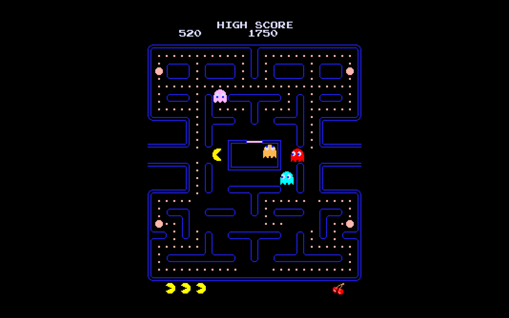

## Settings UI copy

This copy keeps Classic mode at the original Pac-man values and adds a persistent settings bar on top of the game. Press `SETTINGS` in the bar, or press `F1`, to open the full panel.

Added settings include play modes, game speed, Pac-man speed, ghost speed, frightened duration, starting lives, invincibility, master volume, touch D-pad, FPS display, VSync, target FPS, fullscreen, quality, window size, UI scale, reduced flashing, and color assist.

Play modes:

- Classic - original behavior and default values.
- Chill - slower game pace, slightly kinder ghosts, longer frightened time.
- Turbo - faster arcade pace.
- Nightmare - faster ghosts, shorter frightened time, fewer lives.
- Practice - slower ghosts, more lives, invincibility.
- Zen - relaxed speed and long frightened windows.

## Install

Download the latest release from [GitHub Releases](https://github.com/proki000/pac-man-settings-ui/releases/latest).

Windows:

1. Download `PacManSettings-Windows.zip`.
2. Right-click the zip file and choose `Extract All`.
3. Open the extracted folder.
4. Run `PacManSettings.exe`.

Android:

1. Download `PacManSettings.apk` on your Android device.
2. Open the APK file.
3. Allow installation from your browser or file manager if Android asks.
4. Launch `PacManSettings` after it installs.

If Windows or Android warns that the app came from the internet, choose the option to keep/open/install it only if you trust this release.

## Build APK and Windows

Open `Pac-man` in Unity `2021.3.24f1`, or run the local batch build script:

```powershell
cd Pac-man
.\build.ps1 -Target Windows
.\build.ps1 -Target Android
.\build.ps1 -Target All
```

Outputs are written to `Pac-man/Builds/Windows/PacManSettings/PacManSettings.exe` and `Pac-man/Builds/Android/PacManSettings.apk`.

The repo also includes `.github/workflows/unity-builds.yml` for GitHub Actions builds. Add Unity license secrets (`UNITY_LICENSE`, and if needed `UNITY_EMAIL` / `UNITY_PASSWORD`) and run the workflow to publish Windows and Android artifacts.

## How to play

- Windows: [download](https://github.com/proki000/pac-man-settings-ui/releases/latest) the zip file, extract it and run the `.exe` file.
- Android: [download](https://github.com/proki000/pac-man-settings-ui/releases/latest) the APK file and install it on your device.
- Linux and Mac: download the source code, open it in Unity and build the game for your platform.

## Game description

Pac-man is an arcade game from the 80s where the player controls a character called Pac-man. The goal is to eat all the dots in the maze and advance to the next level. Meanwhile, four ghosts - Blinky (red), Pinky (pink), Inky (blue), and Clyde (orange) - are trying to catch the player. If Pacman eats a big dot, the ghosts get frightened and become vulnerable. Vulnerable ghosts can be eaten for bonus points. If Pacman eats all four ghosts, he gets an extra life. In each level, a bonus symbol (usually fruit) appears twice, which can be eaten for extra points. After eating all 244 dots, the player advances to the next level, where the ghosts are faster, more aggressive, and vulnerable for a shorter time. The game ends when the player loses all lives.

## Controls

The player controls Pacman using the arrow keys or WSAD. It is possible to do a pre-turn or post-turn, which means starting the turn a few pixels before (or after) the center of the turn. This allows the player to turn faster than the ghosts.

The game can be paused using `Escape` or `Space`. On the pause screen, there is a button to control the music volume and a button to return to the main menu from where the game can be closed or restarted.

## The full Pac-man experience

The goal of this project was to create a game that would resemble the original Pac-man game as closely as possible. I used Unity to create the game and tried to keep all the game mechanics, pixel art, and sounds from the original game. The source I used for the game mechanics was [The Pac-Man Dossier](https://pacman.holenet.info/) which is a very detailed description of the game. I tried to implement everything according to this specification. The only thing I did differently was the collision detection, which I used the built-in Unity collision system for.

## Closer look at the game mechanics

Here I will try to briefly describe the most important specifications of the game. I won't go into unnecessary details, those can be looked up in the already mentioned [The Pac-Man Dossier](https://pacman.holenet.info/) if needed.

### Game Levels

There are no major changes to the game as the player progresses through the levels, just some value tweaks. The important thing to note is that the last change is in level 21 - all subsequent levels are the same.

### Ghost Modes

Ghosts have 4 different modes of behavior:

- Chase - chase after Pacman, every ghosts targets a different tile
- Scatter - run back into one of the four corners of the maze, every ghost has their favorite one
- Frightened (fright) - move randomly through the maze. Ghosts in this mode can be eaten.
- Dead - return back to the ghost house. Dead ghosts cannot harm Pacman.

Ghosts cannot directly reverse their direction, but the system can sometimes force them to reverse direction. This happens when they change between the scatter and chase modes and when a power dot is eaten.

### Scatter-Chase Transitions

Ghosts start in the scatter mode and switch to chase mode after a few seconds. Then after chasing Pacman for a while, they scatter again and the whole thing repeats. Ghosts scatter like this only four times, then begins an indefinite chase period. This behavior resets every time Pacman loses a life and at the beginning of a new level.

### Frightened Behavior

Ghosts enter fright mode and reverse their direction whenever Pacman eats a power dot. In later levels, they don't get frightened at all and only reverse their direction. Frightened ghosts move randomly through the maze. The random number generator gets reset with the same seed at the start of each new level and whenever a life is lost. This results in frightened ghosts always choosing the same paths when executing patterns during play. It is possible to gain bonus lives by eating all four ghosts during a single fright period.

### Speed

The game starts with Pacman moving at 80% of his maximum speed. He gets faster as the game progresses but his speed gets reduced to 90% in level 21. On the other hand, ghosts get faster. Blinky is special since he transforms into "Cruise Elroy" after a certain number of dots has been eaten. Elroy is faster than the other ghosts. Ghosts slow down when they get frightened, while Pacman speeds up.

### Special Areas

There are 2 types of special zones in the game

- the tunnel - it teleports the ghosts and Pacman to the other side. Ghosts are slowed down in the tunnel.
- the red zone - ghosts can't move vertically there. This restriction doesn't apply to dead ghosts. There is a red zone directly above the ghost house and a second one above the lowest T shaped obstacle.

### Ghost House Logic

Blinky starts outside of the house, other ghosts start inside. Ghosts return to the house after being eaten. The leaving priority is as follows: Blinky > Pinky > Inky > Clyde. Blinky always leaves immediately. The other ghosts use dot counters and a timer to determine who should leave next. A special global counter is used after Pacman dies. I recommend reading this [section](https://pacman.holenet.info/#CH2_Home_Sweet_Home) of the Pac-Man Dossier for more details.

### Ghost Movement

The maze is divied into 8x8 pixel tiles. Whenever a ghost is in chase or scatter mode, they are trying to reach a **target tile**. For scatter mode its one of the corners of the maze. Every ghost targets a different tile while in chase mode, but it is always somehow linked to Pacman.

- Blinky - directly targets Pacman

- Pinky - targets the tile 4 tiles ahead of Pacman. But if Pacman is moving up, then Pinky targets the tile four tiles up and four tiles to the left. This was caused by an overflow bug in the original game.

- Inky - uses a special middle tile. The middle tile is the tile 2 tiles ahead of Pacman. Now draw a vector from Blinky to the middle tile, then add this vector to the middle tile and you will get Inkys target tile.

- Clyde - targets Pacman if the distance between them is at least 8 tiles. If he gets too close to Pacman, he runs back to his corner.

Ghosts also use a target tile to return home when they die.

### Picking The Next Tile

Ghosts always plan one step into the future.
If a ghost just entered tile A, then he already knows the next tile he will enter - let's call it B.
After entering tile A, the ghost chooses a direction he will set once he reaches the center of tile B.
After reaching the center of tile A, he will set the direction he calculated on the previous tile.

Ghosts pick their next tile only based on the euclidean distance between the next tile and the target tile.
If a ghost has to choose between more tiles that are the same distance from the target tile, then he prefers directions in this order: up, left, down, right.

### Fruit

Fruit appears below the ghost house after the first 70 and the first 170 dots have been eaten. It remains there for a random amount of time between 9 and 10 seconds. Pacman can eat the fruit for bonus points.

### Representation Of The Maze

The maze layout is stored in a plain text file and is loaded into a 2D array at the start of the game. The array can be queried for information about walls, position of the dots, red zones etc.

## Credits

I used the following online assets when creating the game

- [maze and sprites](https://www.spriters-resource.com/arcade/pacman/sheet/52631/)
- [start screen and some UI elements](https://www.spriters-resource.com/arcade/pacman/sheet/113279/)
- [font](https://www.spriters-resource.com/arcade/pacman/sheet/73388/)
- [sound effects](https://www.sounds-resource.com/arcade/pacman/sound/10603/)
